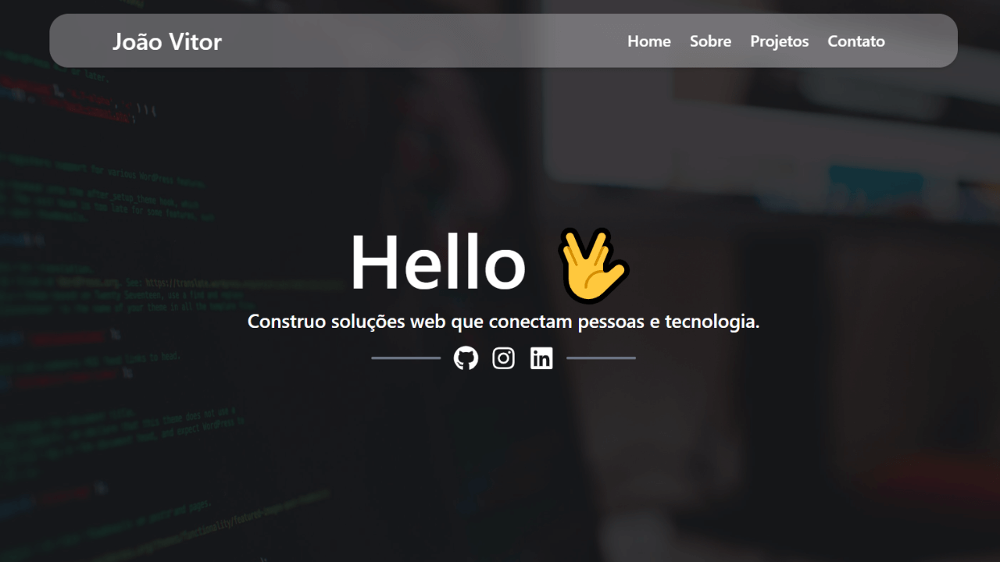
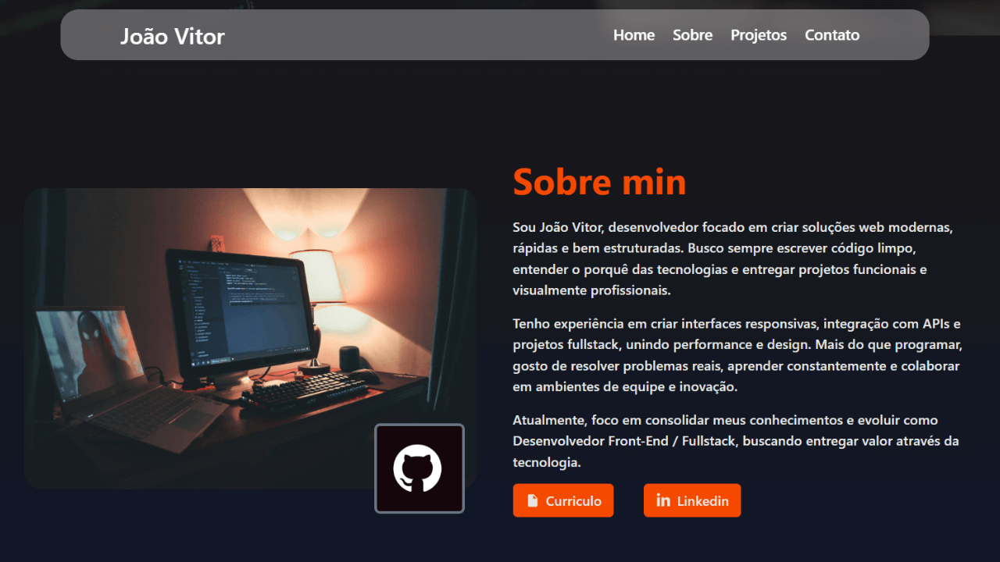

# Portfólio – João Vitor


---

## Sobre o projeto

O **Portfólio – João Vitor** é uma aplicação web desenvolvida com **React**, **TypeScript** e **Vite**, criada para apresentar minhas habilidades como desenvolvedor Front-End, meus principais projetos e formas de contato. O objetivo do projeto é funcionar como meu **cartão de visitas digital**, com uma interface moderna, responsiva e de fácil navegação. O sistema possui **navegação SPA**, páginas organizadas por rotas e formulário de contato integrado com **EmailJS** para envio de mensagens diretamente ao meu e-mail.

**Deploy:** https://joaovitor-portfolio-coral.vercel.app/

---

## Layout

<p align="center">
  
</p>

<p align="center">
  
</p>

---

## Tecnologias utilizadas

O projeto foi desenvolvido com as seguintes tecnologias:

* **React 19** — Biblioteca principal para construção da interface
* **TypeScript** — Tipagem estática e maior segurança no código
* **Vite** — Ferramenta de build rápida e ambiente de desenvolvimento
* **React Router DOM** — Gerenciamento de rotas (SPA)
* **TailwindCSS** — Estilização moderna e responsiva
* **React Icons** — Ícones para interface
* **React Type Animation** — Animação de texto
* **React Toastify** — Notificações na tela
* **EmailJS** — Envio de mensagens pelo formulário de contato
* **ESLint + TypeScript ESLint** — Padronização e qualidade de código

---

## Funcionalidades

* Página **Home** com apresentação pessoal
* Página **Sobre** com trajetória, objetivos e stack de tecnologias
* Página **Projetos** com listagem de projetos em destaque
* Página **Contato** com formulário funcional (EmailJS)
* Navegação SPA sem recarregamento de página
* Interface totalmente responsiva
* Estrutura organizada por componentes reutilizáveis
* Separação de tipagens (`types`) e constantes (`constants`)

---

## Como rodar o projeto

### Pré-requisitos

* [Node.js](https://nodejs.org/)
* [Git](https://git-scm.com/)

---

### Clonando o repositório

```bash
git clone https://github.com/jotavitorz/portfolio.git
cd portfolio
```

---

### Instalando dependências

```bash
npm install
```

---

### Variáveis de ambiente

Crie um arquivo `.env` na raiz do projeto:

```env
VITE_EMAILJS_SERVICE_ID=
VITE_EMAILJS_TEMPLATE_ID=
VITE_EMAILJS_PUBLIC_KEY=
```

Essas variáveis são utilizadas para configurar o **EmailJS** no envio de mensagens do formulário de contato.

---

### Executando o projeto

```bash
npm run dev
```

O projeto será iniciado em:

```
http://localhost:5173
```

---

## Scripts disponíveis

```bash
npm run dev       # Ambiente de desenvolvimento
npm run build     # Build para produção
npm run preview   # Visualizar build local
npm run lint      # Rodar ESLint
```

---

## Links

* **GitHub:** [https://github.com/jotavitorz](https://github.com/jotavitorz)
* **LinkedIn:** [https://www.linkedin.com/in/devjoaovitor](https://www.linkedin.com/in/devjoaovitor)
* **Instagram:** [https://www.instagram.com/jvtorzx/](https://www.instagram.com/jvtorzx/)

---

## Contribuições & Observações

Projeto desenvolvido com foco em aprendizado, prática profissional e construção de marca pessoal como desenvolvedor. Sinta-se à vontade para se inspirar na estrutura, mas personalize com sua própria identidade visual e conteúdo.

<p align="center">
  Feito por <b>João Vitor</b> 🖖
</p>
